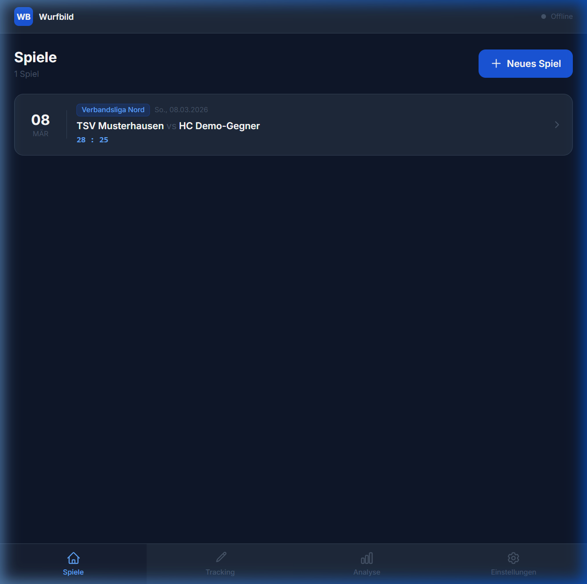
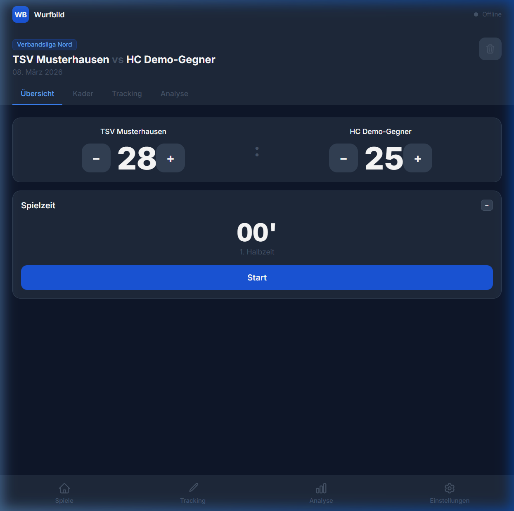
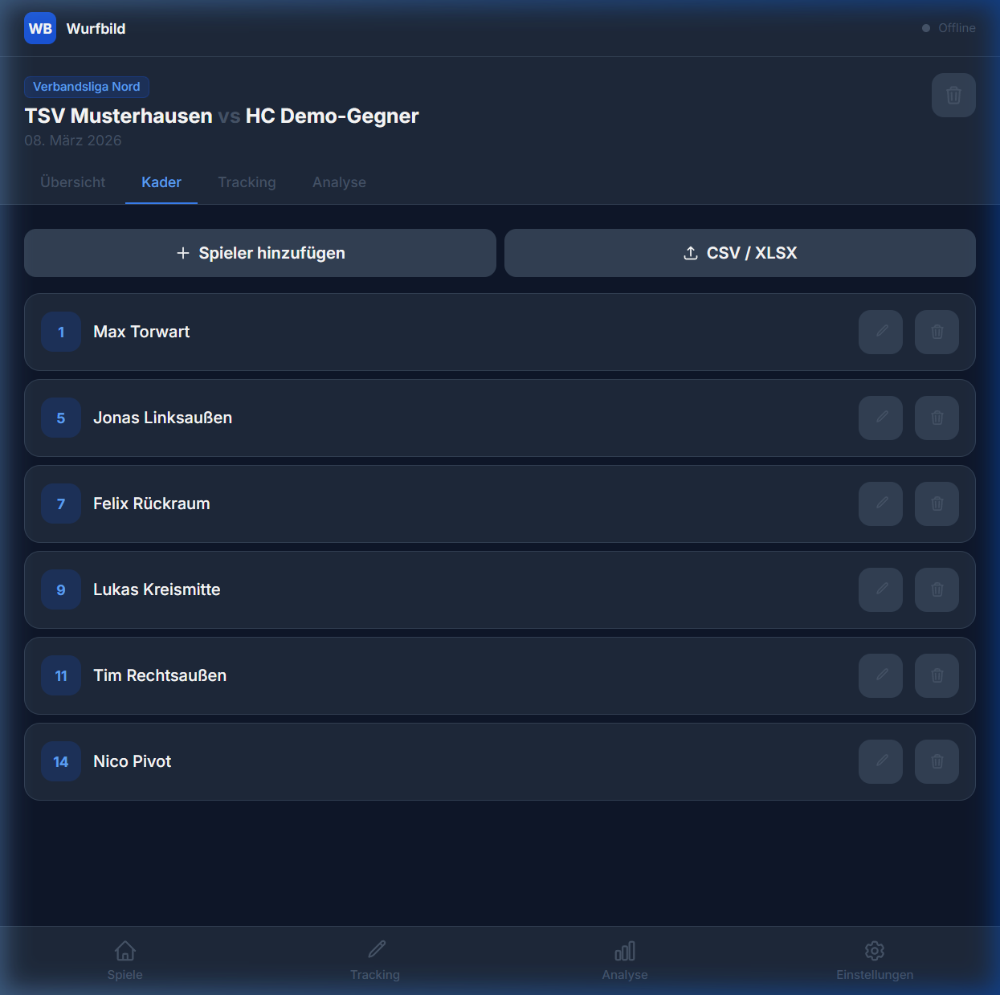
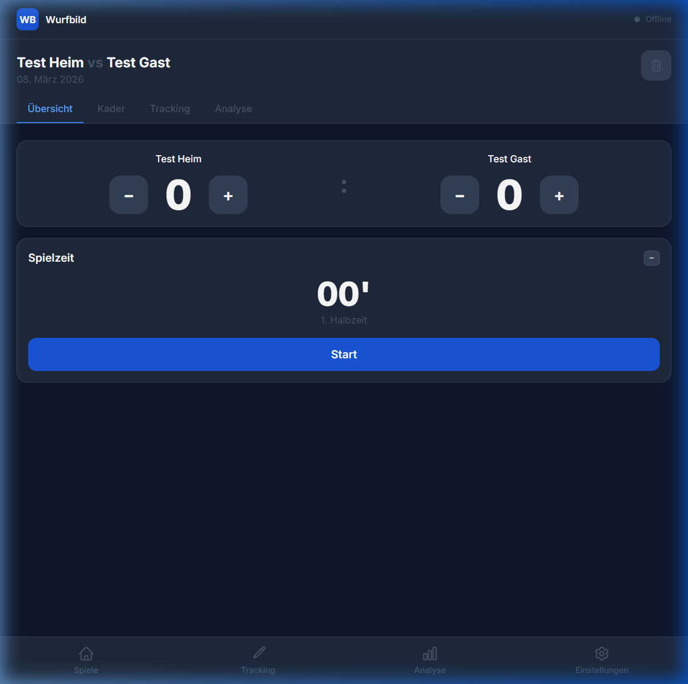
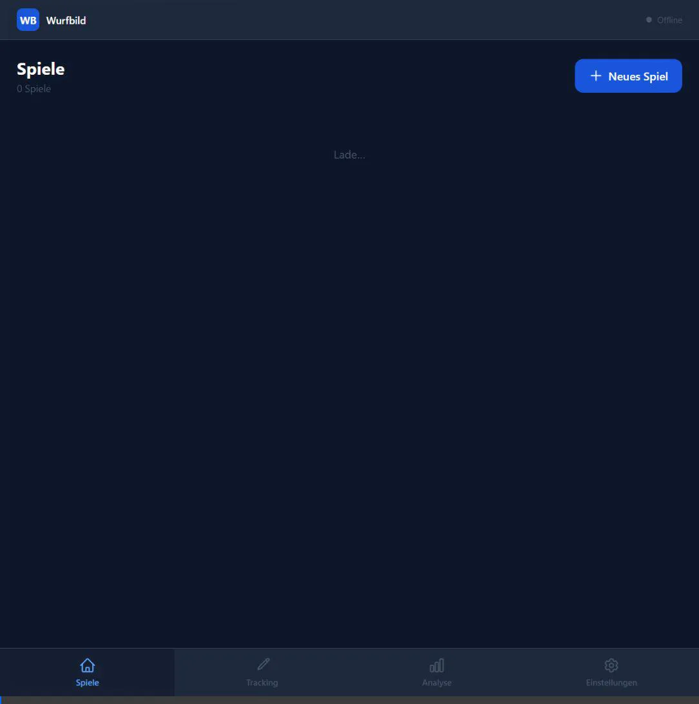

# Handball Wurfbild-App – Entwicklungs-Walkthrough ✅

Hier wird der bisherige Entwicklungsstand dokumentiert. Aktuell sind **Phase 1, 2 und 3** erfolgreich abgeschlossen und in `main` gemergt.

## Phase 1: Projekt-Setup & PWA-Grundgerüst
Vollständiger Aufbau der Entwicklungsbasis für die Handball Wurfbild-App.  
- **Stack:** Vite, React, TypeScript, Tailwind CSS (Dark Mode), ESLint, Prettier.
- **PWA:** `vite-plugin-pwa` eingerichtet (Manifest, Apple-Icons, Workbox Service Worker).
- **Layout:** AppLayout, BottomNav (Tablet-optimiert), Start- und Einstellungsseite.
- **CI/CD:** GitHub Actions (Lint + Build) eingerichtet.

## Phase 2: Datenmodell & IndexedDB
Persistenz-Schicht mithilfe von Dexie.js (IndexedDB wrapper).
- **Typen:** Umfassendes TypeScript-Typensystem (Game, Player, Shot, SevenMeter).
- **DB:** `WurfbildDB` Klasse mit Tabellen und Compound-Indexen.
- **Generics & Hooks:** `useGame`, `usePlayers`, `useShots`, `useSevenMeters` basierend auf `useLiveQuery`.
- **Demo-Daten:** Dev-Seed implementiert (Test-Spiel + Spieler + Würfe).

## Phase 3: Spielverwaltung & Timer
Benutzeroberfläche zur Verwaltung von Spielen. Funktionalität umfasst:
- **Game List:** Reale Übersicht aller Spiele aus der Datenbank (`useGames`).
- **Game Detail:** Neues Modal für schnelle Anlage, Scoreboard (+/- Controller).
- **Timer:** Reativer Timer-Hook (`useGameTimer`) für Halbzeiten, Pause und Stop.
- **Import:** CSV- und Excel (XLSX) Tabellen Import für Gästeteam-Kader via Papaparse / SheetJS (mit UI Vorschau-Modal).

## Screenshots aus Phase 3

````carousel

<!-- slide -->

<!-- slide -->

<!-- slide -->

````

**Demo-Aufzeichnung der Browser-Verifizierung (Phase 3):**  


## Status
Alle 3 Phasen sind live im `main`-Branch verfügbar.  
Nächster Schritt wird **Phase 4: Tracking-Ansicht (Spiel-Logik)** sein.

